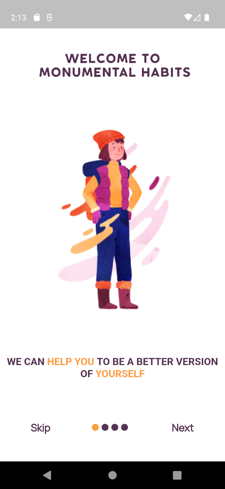

# habit_app

Flutter habit app ui implementation. found this ui kit on [PixelTrue](https://www.pixeltrue.com/free-ui-kits/habit-builder-ui-kit) 

## 📸 Screenshots
|                                   |                               |
| --------------------------------- | --------------------------------- |
|   |   |
|   |   |
|   |   |
